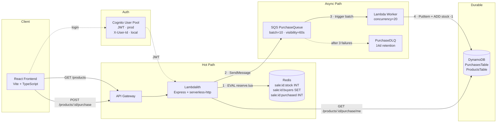
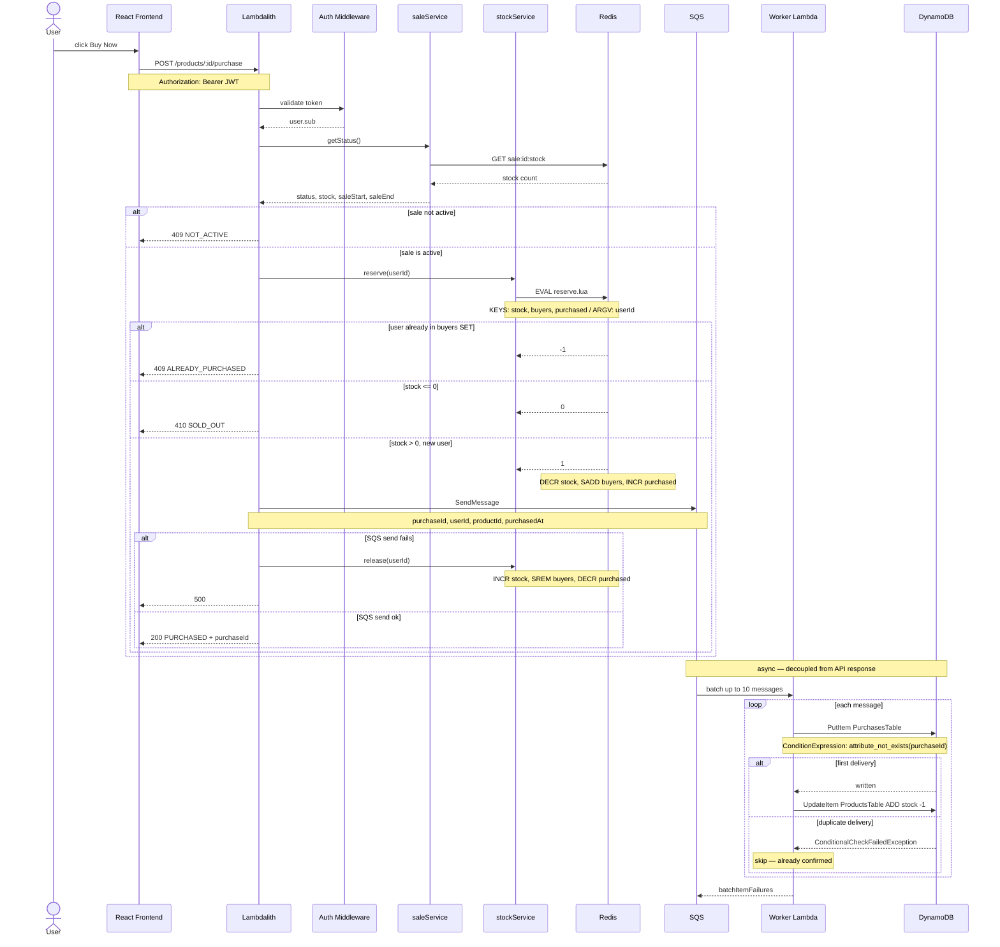
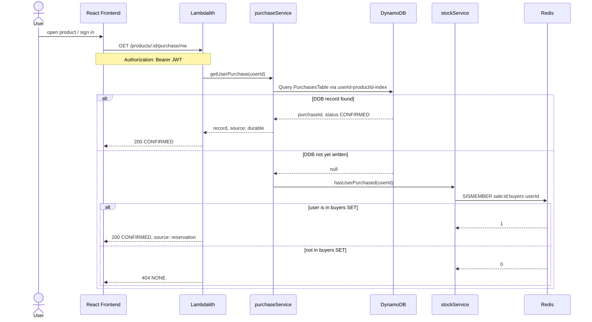
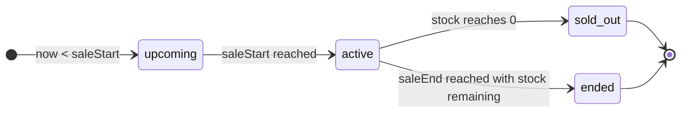
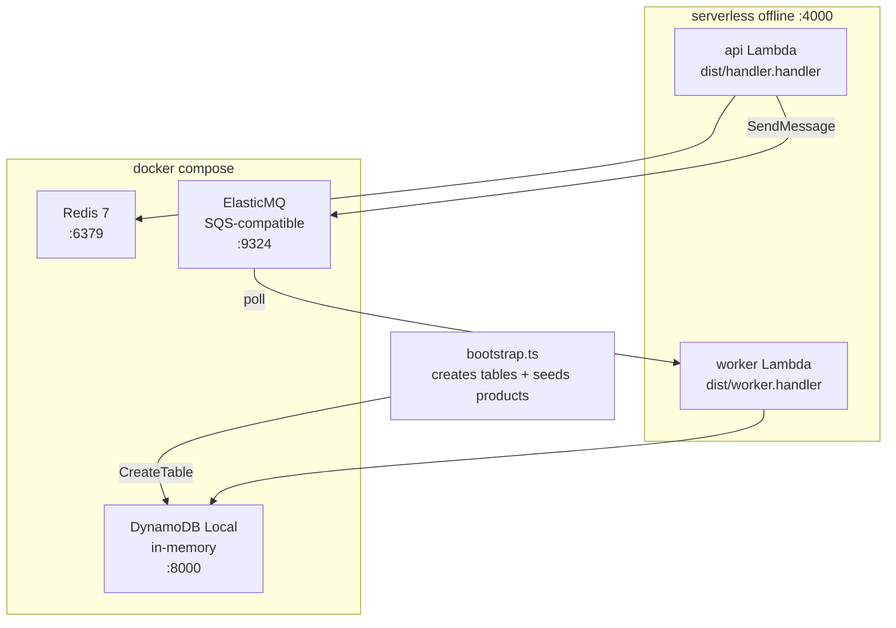

# Flash Sale — Architecture

A high-throughput flash sale platform built on the **lambdalith** pattern: a single Express app
wrapped with `serverless-http` behind one Lambda, backed by Redis for the hot path and DynamoDB
for durable storage.

---

## System Overview



---

## API Endpoints

| Method | Path | Auth | Description |
|--------|------|------|-------------|
| `GET` | `/health` | — | Returns `{ ok: true }`. Load balancer probe. |
| `GET` | `/ready` | — | Pings Redis. Returns 503 if Redis is down. |
| `GET` | `/products` | — | Lists all products with live sale status, stock, and timing. |
| `POST` | `/products/:productId/purchase` | ✅ | Attempt to purchase one unit. Atomic via Redis Lua. |
| `GET` | `/products/:productId/purchase/me` | ✅ | Check if the calling user has a confirmed purchase. |

### Response codes — POST /products/:productId/purchase

| Code | Status | Meaning |
|------|--------|---------|
| `200` | `PURCHASED` | Reservation succeeded, SQS message queued |
| `409` | `ALREADY_PURCHASED` | User already holds a reservation |
| `409` | `NOT_ACTIVE` | Sale has not started or has ended |
| `410` | `SOLD_OUT` | Stock depleted |

---

## Purchase Flow



---

## Check Purchase Status



---

## Sale Status State Machine



Status is computed on every `GET /products` call — no background job needed.
`saleService.getStatus()` reads `sale:{id}:stock` from Redis and compares server time
against `saleStart` / `saleEnd` from the product definition.

---

## Redis Key Schema

| Key | Type | Purpose |
|-----|------|---------|
| `sale:{id}:stock` | `INT` | Remaining units. Decremented atomically by Lua. Never goes below 0. |
| `sale:{id}:buyers` | `SET` | UserIds who have reserved. Prevents double-purchase. |
| `sale:{id}:purchased` | `INT` | Count of completed purchases. Mirrors stock decrement. |

### Why a Lua script and not DECR?

Two invariants must hold **atomically**:
1. `stock > 0` — no overselling
2. User not already in `buyers` — one purchase per user

A plain `DECR` can't check the buyers set. Two round-trips can't enforce both atomically (check-then-act race). The Lua script runs server-side in one step — the invariants hold under any concurrency.

```
return codes
  1  → reserved (success)
  0  → sold_out
 -1  → already_purchased
```

---

## DynamoDB Schema

### PurchasesTable

| Attribute | Type | Role |
|-----------|------|------|
| `purchaseId` | `S` | Partition key — UUIDv4, also the idempotency key |
| `userId` | `S` | Sort key |
| `productId` | `S` | GSI hash key (`userId-productId-index`) |
| `purchasedAt` | `S` | ISO timestamp |
| `status` | `S` | Always `CONFIRMED` after worker writes |

Worker idempotency: `ConditionExpression: attribute_not_exists(purchaseId)`. A duplicate SQS delivery silently fails the condition and is ACK'd without a second stock decrement.

### ProductsTable

| Attribute | Type | Role |
|-----------|------|------|
| `productId` | `S` | Partition key |
| `stock` | `N` | Durable stock counter — decremented by Worker on each confirmed purchase |

---

## Local Infrastructure



`npm start` = `infra:up → bootstrap → build → cleanport → offline`

`serverless-offline-sqs` polls ElasticMQ and invokes the worker Lambda when messages arrive.
ElasticMQ is the queue server; the plugin is the bridge between ElasticMQ and serverless-offline's Lambda invoker.
